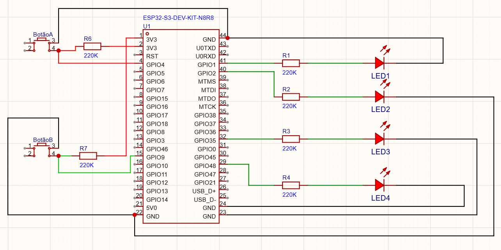

# Atividade 04 — Controle de LED por Botão com ESP32-S3

## Descrição

Implementação de um **contador binário de 4 bits** utilizando um **ESP32-S3**, 4 LEDs e 2 botões no simulador **Wokwi**.

O projeto foi desenvolvido utilizando o **ESP-IDF** como framework de programação. Os LEDs representam o valor atual do contador em formato binário, enquanto os botões controlam o incremento e a unidade de incremento.

## Objetivo

Desenvolver um controlador de LEDs capaz de representar um contador binário de 4 bits, com dois botões para controle do seu funcionamento.

O contador varia de `0x0` a `0xF` e possui comportamento circular.

## Componentes

* ESP32-S3
* 4 LEDs
* 2 botões (Buttons)
* Resistores e componentes necessários para os circuitos de acionamento
* Simulador Wokwi

## Funcionamento

O sistema possui dois botões:

### Botão A — Incremento

A cada acionamento, o contador é incrementado de acordo com a unidade de incremento configurada:

* Unidade `+1`: contador recebe `+1`
* Unidade `+2`: contador recebe `+2`

### Botão B — Unidade de incremento

Alterna a unidade de incremento a cada acionamento:

* Primeiro estado: `+1`
* Segundo estado: `+2`
* Próximo acionamento: `+1`
* E assim sucessivamente.

### Contador de 4 bits

O valor do contador é representado pelos quatro LEDs:

| Decimal | Hexadecimal | Binário |
| ------: | ----------: | :-----: |
|       0 |       `0x0` |  `0000` |
|       1 |       `0x1` |  `0001` |
|       2 |       `0x2` |  `0010` |
|     ... |         ... |   ...   |
|      14 |       `0xE` |  `1110` |
|      15 |       `0xF` |  `1111` |

O contador sempre permanece dentro do intervalo de **0 a 15**.

### Overflow

O contador possui comportamento circular, considerando a unidade de incremento atual.

Exemplos:

* `0xF + 1 → 0x0`
* `0xE + 2 → 0x0`
* `0xF + 2 → 0x1`

Dessa forma, o resultado permanece sempre representado por 4 bits.

## Debounce

O **debounce dos botões é realizado por software**, evitando múltiplas leituras causadas pelo efeito mecânico do acionamento.

A implementação não utiliza `delay` para realizar o debounce.

## Estrutura do Projeto

O projeto contém os seguintes arquivos e materiais:

```text
├── Diagrama de Bloco
├── Diagrama Esquemático
├── main
│   └── código-fonte do projeto
├── Foto da Simulação
└── README.md
```

### Diagrama de Bloco

Apresenta a estrutura geral do sistema, mostrando a relação entre o ESP32-S3, os botões, os circuitos de driver e os LEDs.

### Diagrama Esquemático

Apresenta as conexões elétricas utilizadas para montar o contador de 4 bits.

### Código

O código principal está localizado na pasta `main` e foi desenvolvido utilizando o **ESP-IDF**.

### Simulação

A simulação permite verificar o funcionamento do contador e o comportamento dos botões e LEDs.

## Simulação no Wokwi

O projeto pode ser acessado e executado diretamente no Wokwi:

**[Acessar simulação no Wokwi](https://wokwi.com/projects/474784787467682817)**


## Diagrama Esquemático



## Tecnologias Utilizadas

* **ESP32-S3**
* **ESP-IDF**
* **C**
* **Wokwi**

## Resultado

A implementação atende aos requisitos propostos na atividade, utilizando os dois botões para controlar o contador e os quatro LEDs para representar seu valor binário, com incremento configurável entre `+1` e `+2` e tratamento de overflow para manter o valor dentro dos 4 bits.
