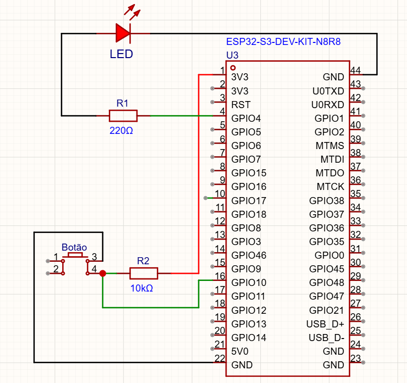
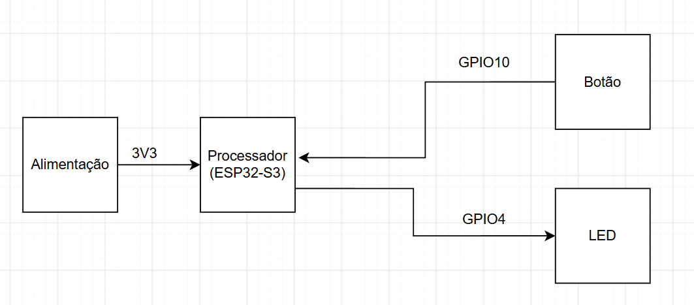

# Atividade 06 — Sistema de Iluminação com Temporizador

## Objetivo

Implementar o controle de um LED por botão utilizando **polling**, temporizador por software e **debounce**, mantendo o sistema não bloqueante.

## Materiais

* ESP32 DevKit
* LED
* Resistor de 220 Ω
* Botão
* Resistor de 10 kΩ
* Protoboard e cabos

## Funcionamento

* **LED apagado:** pressionar o botão acende o LED e inicia o temporizador de **30 segundos**.
* **LED aceso:** pressionar novamente reinicia o temporizador para **30 segundos**.
* **Pressionamento longo:** manter o botão pressionado por mais de **2 segundos** desliga o LED imediatamente.
* A leitura do botão é realizada por **polling**, sem bloquear a execução do sistema.
* O efeito **bounce** é tratado por software.
* Não são utilizadas funções de atraso como `vTaskDelay()` ou `rom_delay_us()`.

## Simulação no Wokwi

O projeto pode ser acessado e executado diretamente no Wokwi:

**[Acessar simulação no Wokwi](https://wokwi.com/projects/476054465475543041)**

## Diagramas

### Diagrama Esquemático

### Diagrama de Bloco

