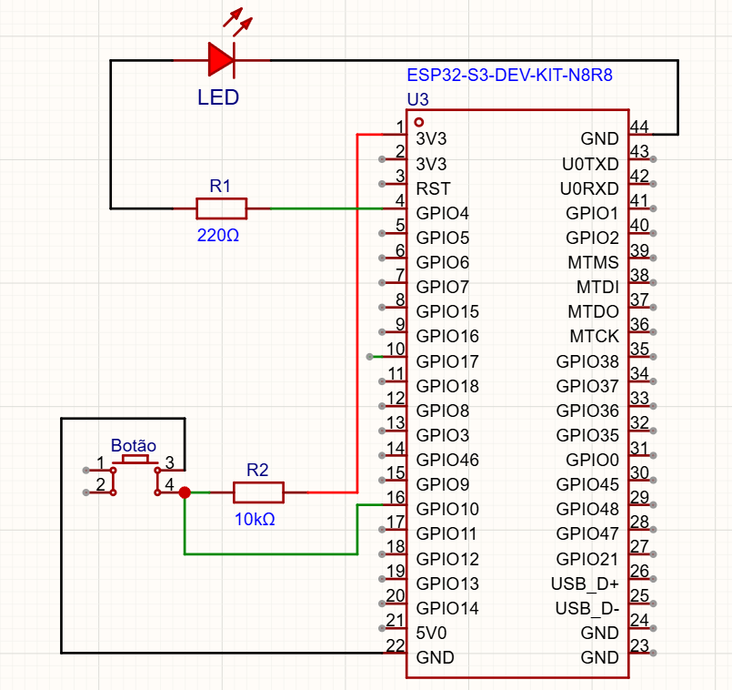
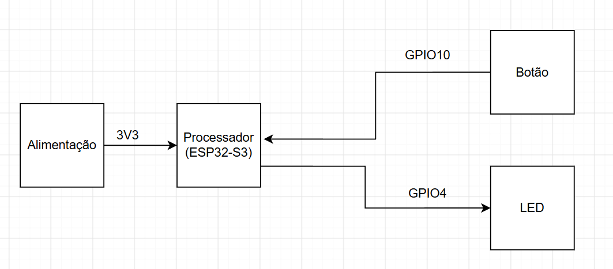
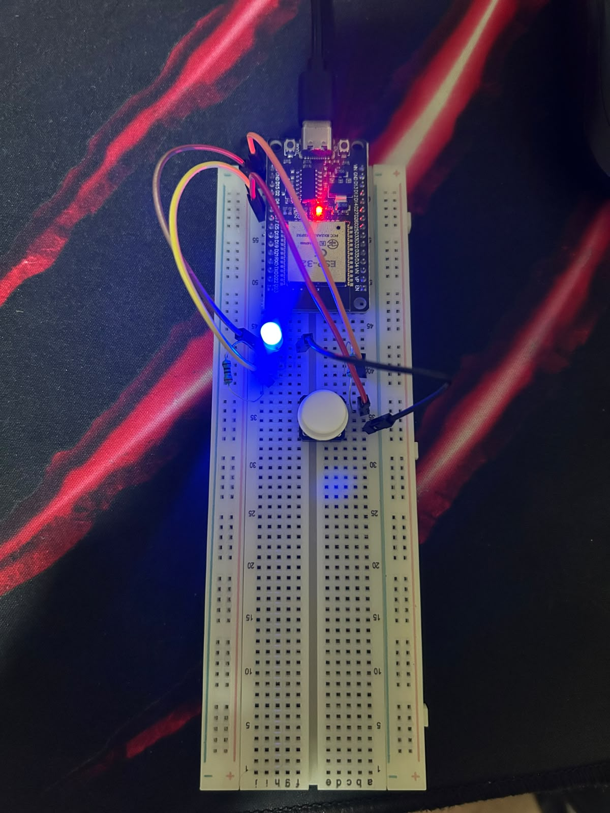

# Atividade 07 — Controle de Eventos Críticos com Interrupções e Temporizadores

## Objetivo

Refatorar o sistema de iluminação temporizada da atividade anterior substituindo a técnica de polling por Interrupções de Hardware (ISR) e temporizadores do ESP32, liberando a CPU para execução de outras tarefas ou modos de baixo consumo.

## Materiais

* 1 ESP32 (DevKit)
* 1 LED + 1 Resistor de 220 Ω
* 1 Botão + 1 Resistor de 10 kΩ
* Protoboard e cabos

## Funcionamento

Passos para a Atividade:
1. Desenvolvimento do firmware:
* Toda a detecção de ação no botão deve ser realizada via Interrupção de Hardware (GPIO ISR).
* A rotina de interrupção deve ser enxuta e alocada preferencialmente na IRAM (IRAM_ATTR).
2. Tratamento de Debounce por Software:
* O sistema deve tratar o efeito bounce mecânico do botão por software sem travar a execução do processador.
3.  Controle de Temporização Ativa (Sem Polling):
* Primeiro Acionamento: Liga o LED e inicia a contagem de 10 segundos.
* Renovação de Tempo: Se o LED já estiver aceso e ocorrer um novo acionamento rápido, o tempo de 10 segundos deve ser renovado/reiniciado sem apagar o LED.
* Desligamento Forçado (Pressionamento Longo): Se o botão for mantido pressionado por 2 segundos ou mais, o LED deve apagar imediatamente e qualquer temporizador ativo deve ser cancelado.

## Simulação no Wokwi

O projeto pode ser acessado e executado diretamente no Wokwi:

**[Acessar simulação no Wokwi](https://wokwi.com/projects/477264933067113473)**

## Diagramas

### Diagrama Esquemático

### Diagrama de Bloco

### Projeto na placa

